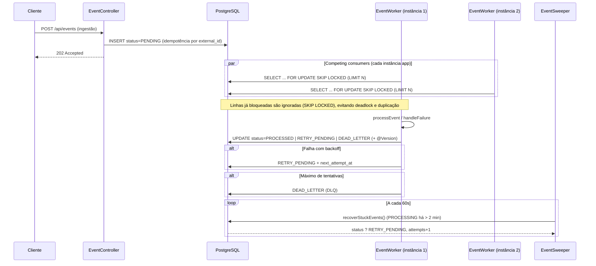

# Motor de Processamento de Eventos

API HTTP recebe eventos, grava o estado no PostgreSQL e workers agendados processam a fila em paralelo. Cada worker pega um lote com `FOR UPDATE SKIP LOCKED`, aplica retentativas com backoff, manda para DLQ quando esgota tentativas e o sweeper devolve eventos presos em `PROCESSING`.

Stack: Java 21, Spring Boot, Flyway, imagem Docker multi-stage e Docker Compose para rodar localmente com mais de uma instância da app.

## Tecnologias

| Camada | Tecnologia |
|--------|------------|
| Linguagem | Java 21 |
| Framework | Spring Boot 4.1.x (Web, Data JPA, Validation, Scheduling) |
| Banco de dados | PostgreSQL 16 |
| Migrações | Flyway (`V1` a `V2`) |
| Build | Maven 3.9+ |
| Containerização | Docker (multi-stage `dockerfile`) + Docker Compose |
| Testes | JUnit 5, Testcontainers, `@ServiceConnection` |

## Visão geral da arquitetura



## Padrões de arquitetura

### Competing Consumers com `FOR UPDATE SKIP LOCKED`

Cada instância do serviço `app` (ou cada JVM) chama `findPendingEvents` com `FOR UPDATE SKIP LOCKED`. A transação trava só as linhas que pegou; o resto das instâncias ignora linha já bloqueada em vez de ficar esperando. Na prática isso corta deadlock e trabalho duplicado quando você sobe várias réplicas, sem broker só para coordenar lock.

A query pega eventos `PENDING` ou `RETRY_PENDING` com `next_attempt_at` nulo ou no passado, ordena por `created_at` e limita o lote (`FIND_CHUNKS = 3` no worker).

### Idempotência via `external_id`

`external_id` é único no banco e vem do `eventId` na API. O `EventService` checa `existsByExternalId` antes de inserir; se duas requisições chegam juntas, a `DataIntegrityViolationException` conta como evento já aceito. O mesmo `eventId` de novo não gera segunda linha.

### Resiliência, backoff e DLQ

- Até 3 tentativas (`MAX_ATTEMPTS`) no worker.
- Falha: `RETRY_PENDING`, `attempts` sobe e `next_attempt_at` avança 15 × tentativa segundos (backoff linear).
- Depois do limite: `DEAD_LETTER` na mesma tabela (DLQ lógica).
- Tipo `FAIL_TEST` força erro no worker, útil para testar manualmente.

### Self-healing / Crash recovery (`EventSweeper`)

A cada 60s o `@Scheduled` chama `recoverStuckEvents()`. Evento em `PROCESSING` com `updated_at` há mais de 2 minutos volta para `RETRY_PENDING`, incrementa `attempts` e ganha nova janela (+30s na query nativa). Serve para instância ou worker que morreu no meio do processamento.

### Optimistic locking (`@Version`)

Coluna `version` na entidade `Event` (Flyway `V2`). O Hibernate incrementa em cada `UPDATE`; duas escritas concorrentes na mesma linha podem estourar `ObjectOptimisticLockingFailureException`, além do lock da poll.

## Modelo de dados (`event`)

| Campo | Tipo | Descrição |
|-------|------|-----------|
| `id` | UUID | Chave primária gerada pela aplicação |
| `external_id` | VARCHAR (UNIQUE) | Identificador do produtor (idempotência) |
| `type` | VARCHAR | Tipo do evento (ex.: `PAYMENT_RECEIVED`) |
| `source` | VARCHAR | Origem do evento |
| `status` | VARCHAR | `PENDING`, `PROCESSING`, `PROCESSED`, `RETRY_PENDING`, `DEAD_LETTER` |
| `attempts` | INT | Contador de tentativas de processamento |
| `next_attempt_at` | TIMESTAMPTZ | Próxima execução para retentativa |
| `payload` | JSONB | Corpo do evento |
| `occurred_at` | TIMESTAMPTZ | Momento do fato de negócio |
| `created_at` / `updated_at` | TIMESTAMPTZ | Auditoria temporal |
| `version` | BIGINT | Optimistic locking |

Índice `idx_event_status_next_attempt (status, next_attempt_at)` para a busca do worker.

## API REST

| Método | Endpoint | Descrição | Resposta |
|--------|----------|-----------|----------|
| `POST` | `/api/events` | Ingestão de evento (assíncrono) | `202 Accepted` |
| `GET` | `/api/admin/events/metrics` | Contagem por status (saúde / lag) | `200` + `EventMetricsDTO` |
| `POST` | `/api/admin/events/redrive` | Reprocessa todos em `DEAD_LETTER` ? `PENDING` (zera `attempts`) | `200` + mensagem e `reprocessedCount` |

Endpoints em `/api/admin/*` têm `TODO` de autenticação no código; trate como admin-only em produção.

### Exemplo de ingestão

```bash
curl -s -X POST http://localhost:8080/api/events \
  -H "Content-Type: application/json" \
  -d '{
    "eventId": "evt-2026-001",
    "type": "PAYMENT_RECEIVED",
    "source": "billing-service",
    "occurredAt": "2026-10-06T15:00:00-03:00",
    "payload": { "amount": 150.75, "currency": "BRL" }
  }'
```

### Exemplo de métricas

```bash
curl -s http://localhost:8080/api/admin/events/metrics
```

## Estrutura do repositório

```
src/main/java/com/motor/demo/
??? EventApplication.java          # @EnableScheduling
??? controllers/
?   ??? EventController.java       # Ingestão HTTP
?   ??? EventAdminController.java  # Métricas e redrive DLQ
??? dtos/
??? entities/Event.java            # JPA + @Version + JSONB
??? enums/EventStatus.java
??? repositories/EventRepository.java  # SKIP LOCKED + recoverStuckEvents
??? services/EventService.java     # Idempotência na ingestão
??? workers/
    ??? EventWorker.java           # Poll + processamento + retry/DLQ
    ??? EventSweeper.java          # Recuperação de PROCESSING travados

src/main/resources/db/migration/   # Flyway
src/test/java/.../EventIntegrationTest.java
docker-compose.yml
dockerfile
```

## Quickstart

### Pré-requisitos

- Docker e Docker Compose
- (Opcional) JDK 21 e Maven para desenvolvimento e testes locais

### Subir o ambiente (escala horizontal)

Na raiz do projeto:

```bash
docker compose up --build --scale app=3
```

Sobe o PostgreSQL 16 (`event_engine_db`) na porta 5433 do host (5432 no container) e três réplicas da app na mesma imagem, todas usando o mesmo banco. Cada réplica roda `EventWorker` e `EventSweeper` por conta própria.

No serviço `app`:

- `SPRING_DATASOURCE_URL=jdbc:postgresql://postgres:5432/event_engine_db`
- `SPRING_DATASOURCE_USERNAME` / `SPRING_DATASOURCE_PASSWORD`

O Compose não publica a porta 8080 da app no host. Para chamar a API de fora, mapeie `ports: ["8080:8080"]` no serviço `app`, use `docker compose exec`, ou um proxy na frente.

### Desenvolvimento local (sem escalar app)

1. Subir apenas o banco: `docker compose up postgres -d`
2. `application.properties` aponta para `localhost:5433`
3. Executar: `./mvnw spring-boot:run`

### Testes automatizados (Testcontainers)

```bash
./mvnw test
```

`EventIntegrationTest` sobe PostgreSQL 16 com `@Container` e `@ServiceConnection`, exercita `findPendingEvents` (SKIP LOCKED), roda um ciclo do `EventWorker` e confere `PROCESSED` e `version` no banco.

## Configuração relevante

| Propriedade | Valor padrão (local) |
|-------------|----------------------|
| `spring.jpa.hibernate.ddl-auto` | `validate` (schema via Flyway) |
| `spring.flyway.enabled` | `true` |
| Worker poll | `@Scheduled(fixedDelay = 5000)` |
| Sweeper | `@Scheduled(fixedDelay = 60000)` |
| Lote por poll | `FIND_CHUNKS = 3` |

## Licença e contribuição

Demo do motor. Em produção você provavelmente vai querer endurecer retry, proteger `/api/admin/*` e plugar métricas/tracing (Prometheus, OpenTelemetry, o que fizer sentido no seu stack).
